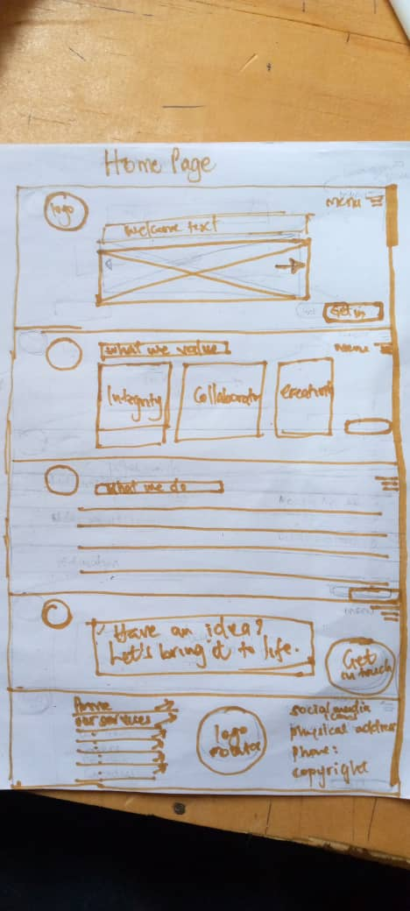
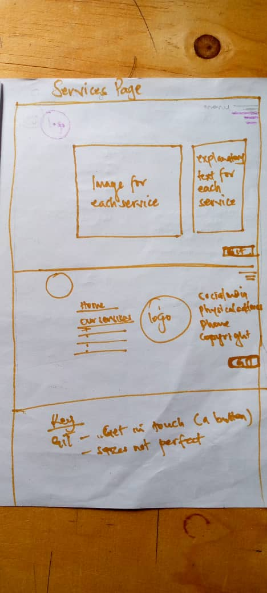
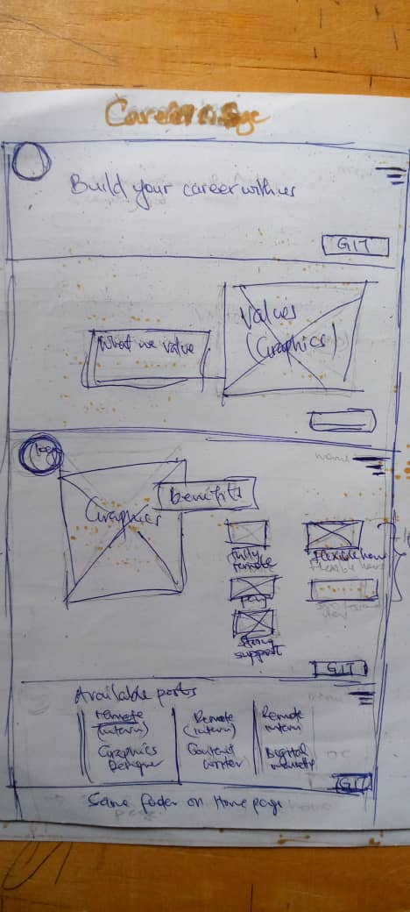
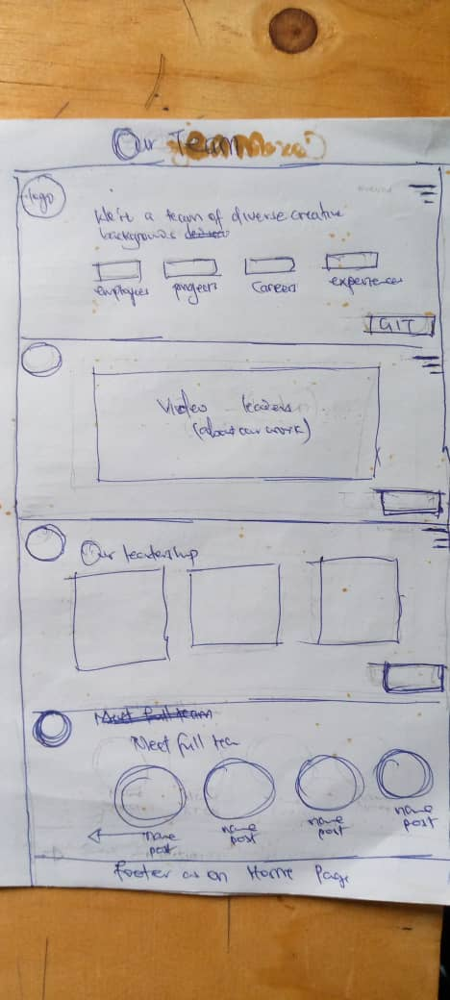
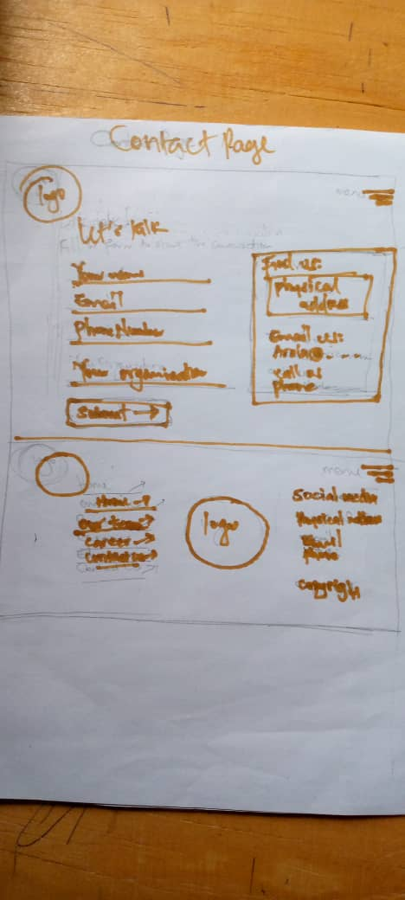

# Arola-Tech

## Folder structure

1. All **.html** files are in the root directory - this is level 1 (01).

2. All utilities files, such as .css, .js and images(.png,.jpeg,.jpg,.gif, etc)
    are for level 1 .html files and are in **01-pages-util-folders**, which has a subfolder
    for each page containing those utility files. *These files contain specific* 
    *information for each page on the website*.

3. Each of the page utility subfolder contains four subfolders, local-css, images,
    data and local-js. 
    
    The **local-css** folder contains any cascading style sheet that is **specific** only to this page (as opposed to style sheets that are common across all pages), generally there are not many of these, usually only where a page runs a particular script that has an associated CSS file. If the page has no local CSS files, the folder will still exist, but will be empty.

    The **images** subfolder contains all the images (with the exception of certain background images that are used by the common CSS files) that are used on the page. Generally, the images on a page are unique to that page. If the page has no images, the folder will still exist, but will be empty.

    The **data** subfolder is used to hold data files containing page specific information (software examples, downloads, and any other information specific to the particular web page that doesn’t fall into the other categories).

    The **local-js** subfolder: Every page has its own jQuery script file, this controls the slow scrolling to the various points on the page (figures, tables, sections &c.). These files are all unique; all are dependent on the configuration of the page.

4. The **resources folder** on level 1 holds all the common files that we developed for the website i.e. it is the stuff that we’ve written specifically for the site. The **global folder** contains common files for the website but *we did not create its content*. This is content we got from other people such as fonts, jQuery plugins and certain CSS files; but all were used under licence on the website. *Both these contain the same four subfolders as* *those in the pages utility subfolders, that is, local-css, images, data and local-js*. 

## Project overview

### Project Highlights
The projects is a website where clients can find services for their companies or their interests. 

### Project Objectives
The project seeks to make a website for our software development company. We hope to 
start small as students till we get from the ground.

### Contributors
1. Allan Baliddawa 
2. Patience Mulungi
3. Samuel Katongole

## Installation Instructions
No much installations needed.

## Usage Guidelines
No special guidelines are needed.

## Configuration
Not needed.

## Contribution Guidelines
1. The contributors should follow the project structure as is in the project. 
   Inquiries where not clear can be made. 
2. Contributors should document their code so well for quick understanding
3. Contributors should make pr as early as possible to have quick feedback
4. Contributors may include the date of their contribution in the commit message description. 

## Licence
MIT Licence

## Formatting Tips
Nothing special.

## Wireframes for the project
### Home page

### Services page

### Careers page

### Teams page

###
